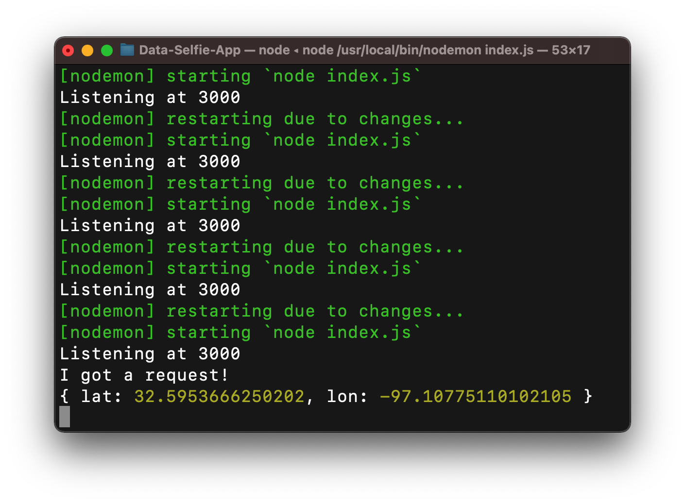
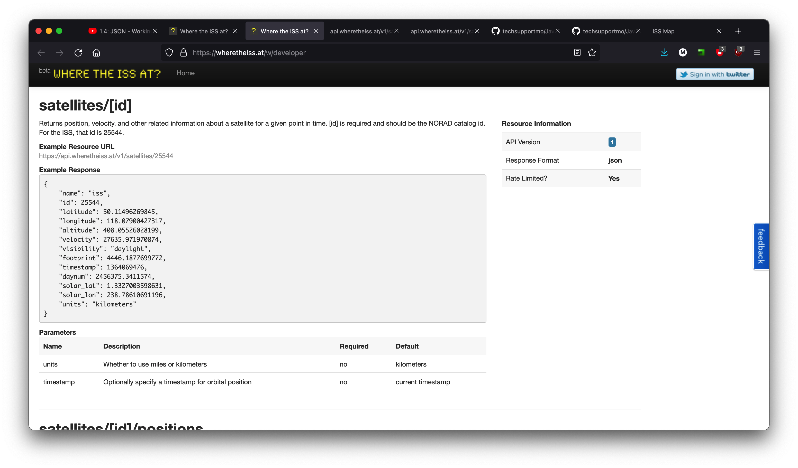
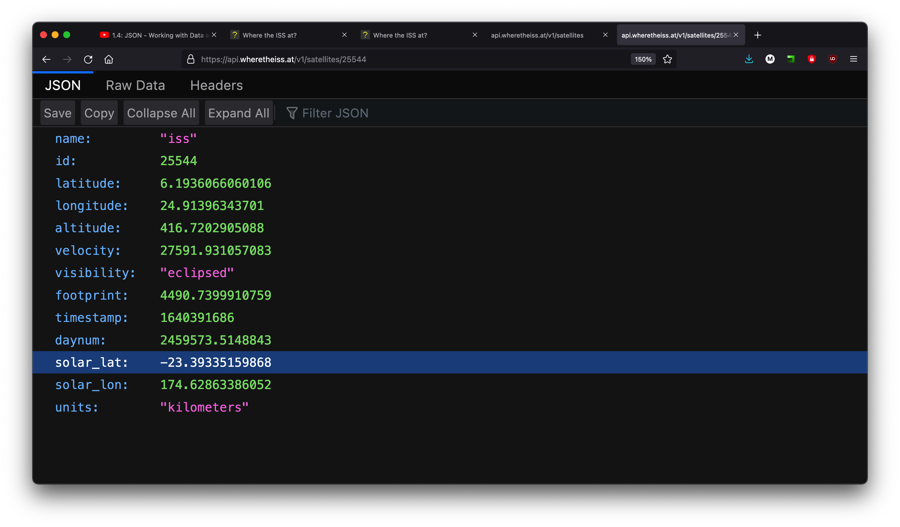
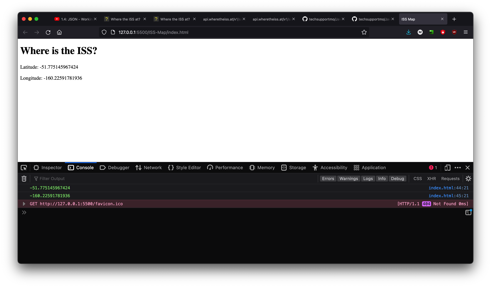
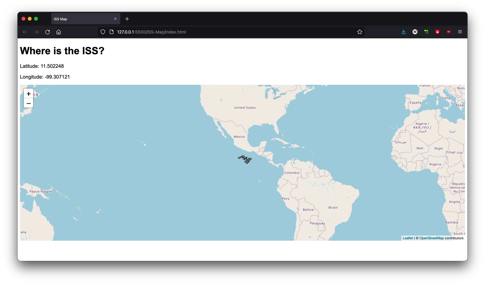
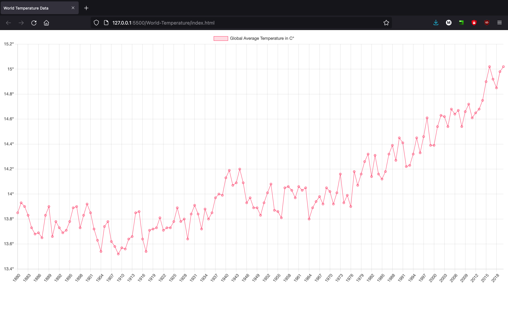
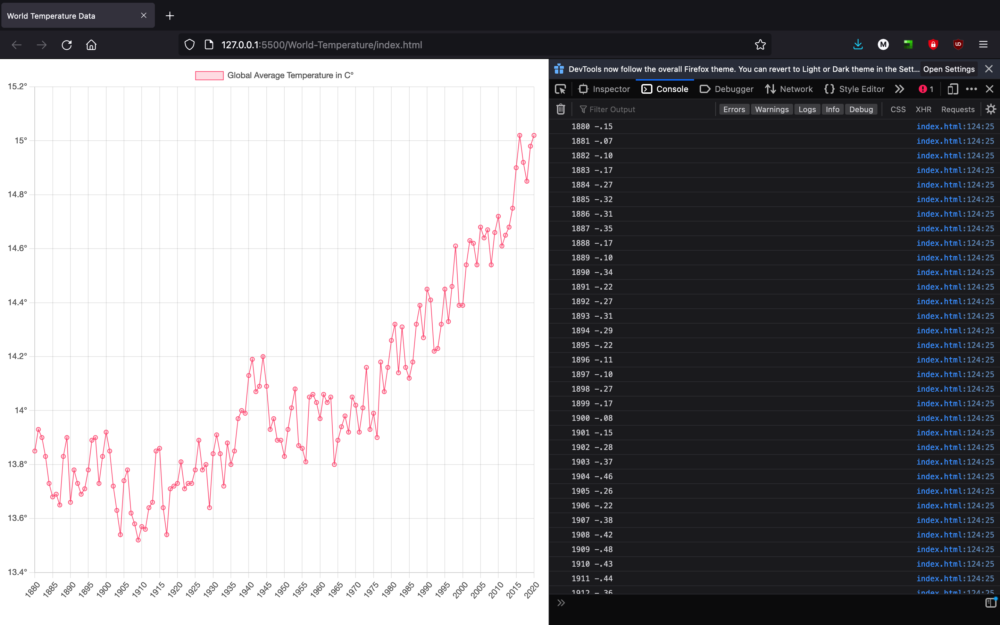
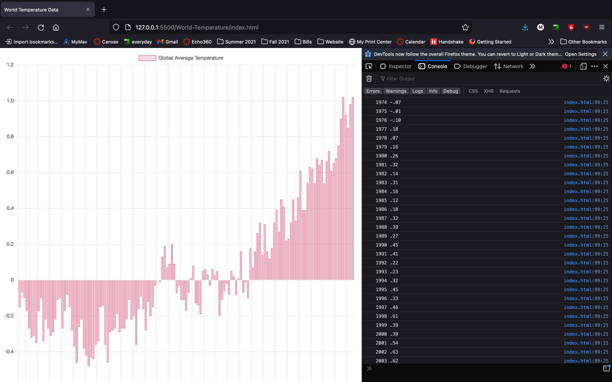

# JavaScript
 A couple of projects I have made using JavaScript :weary: :sweat_drops: :fire:

  
 
 ## Projects
 - [Data Selfie App](#Data-Selfie-App)
 - [International Space Station (ISS) Map](#international-space-station-iss-map--rocket-round_pushpin)
 - [World Temperature](#World-Temperature-earth_americas)

  

  

# Data Selfie App

Add description here

 
 

# International Space Station (ISS) Map  :rocket: :round_pushpin:

This application uses <a href="https://leafletjs.com/">Leaflet.js</a> to display an interactive map with the location of the International Space Station

In order to create this project, I had to fetch data from a particular endpoint of the <a href="https://wheretheiss.at/w/developer">Where Is The ISS At?</a>  REST API. 

This allowed me to access real-time data about the International Space Station, which I converted to JSON format. After that, I destructured the data into two seperate variables, latitude and longitude, and redisplayed it onto the webpage.

 

API Documentation

JSON

Latitude and Longitude printed on the webpage, as well as the console

After retrieving the latitude and longitude, I used Leaflet.js to create an interactive map that would display the ISS as a marker, and I used the setInterval() to make sure that the location would be updated every second

 

 # World Temperature :earth_americas:
 This program uses <a href="https://www.chartjs.org/">Chart.js</a> in order to display an interactive graph with the Global Average Temperature in Celsius from 1880 to 2020

This project involves
- Loading CSV file
    - This was done by retrieving a .csv file with the zonal annual means of Combined Land-Surface Air and Sea-Surface Water Temperature Anomalies from 1880-present. 
    - This dataset was retrieved <a href="https://data.giss.nasa.gov/gistemp/">here</a>
- Manual parsing
    - The dataset was parsed by using JavaScript functions like slice() and split() in order to extract the year and the global annual mean
- Chart.js
    - This library allowed me to display the dataset using an interactive graph
- HTML5 Canvas
- Modifying chart style
    - Many elements of the chart can be changed, and Chart.js allowed me to specifically customize the graph in terms of the type of graph it is (ie bar graph, line graph, pie graph), background color, border color, and x and y labels.

 

The same line graph as above, along with the console printing the values that were extracted from the .csv file.

A different way to look at the data would be with a bar graph, which doesn't display the Global Average Temperature, but the difference from the Global Mean, which is roughly 14° Celcius. This data was found <a href="https://earthobservatory.nasa.gov/world-of-change/global-temperatures"> here</a>

 

